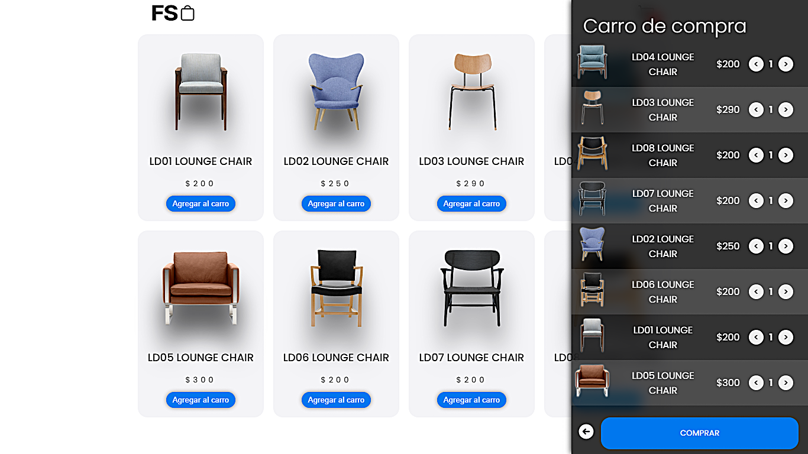

# 📘 Tarjeta de Compra

Proyecto simple e intuitivo para aprender cómo funciona un carrito de compras básico en la web. Utiliza tecnologías frontend para mostrar productos, permitir agregar al carrito y visualizar el total.

## 🛠️ Tecnologías utilizadas

- **HTML5:** Para estructurar el contenido.
- **CSS3:** Para dar estilo a las tarjetas de productos y el carrito.
- **React:** Para manejar la lógica de agregar productos, calcular totales y actualizar el DOM.

## 👤 Experiencia de Usuario Mejorada

- Diseño responsive para escritorio y móvil.
- Mensajes de confirmación al agregar productos.
- Visualización en tiempo real del número de productos y precio total en el carrito.
- Botón para eliminar productos del carrito individualmente o vaciarlo por completo.

## 🎯 Objetivos del Proyecto

- Comprender cómo se estructura un proyecto frontend desde cero.
- Aplicar manipulación del DOM con JavaScript.
- Crear una funcionalidad de carrito de compras sin necesidad de backend.
- Mejorar habilidades en diseño de interfaces web amigables.

## 🖥️ Capturas de pantalla

